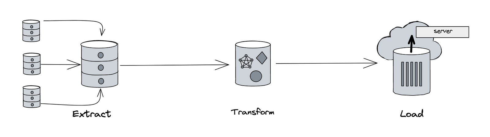

# ETL-example

## Extract data
In the first step of an ETL process, we extract data from one or more source systems. The source systems can be databases, files, APIs, or any other type of data repository. The extracted data can be in various formats, such as CSV, Excel, JSON, XML, or a database table.

## Transform data
In the second step of an ETL process, we transform the data that we have extracted from the source system. The transformation step involves cleaning, restructuring, and enriching the data to make it suitable for analysis and loading into the target system.

## Load data
In the final step of an ETL process, we load the transformed data into the target system. The target system can be a data warehouse, a database, a cloud storage service, or any other type of data repository.

